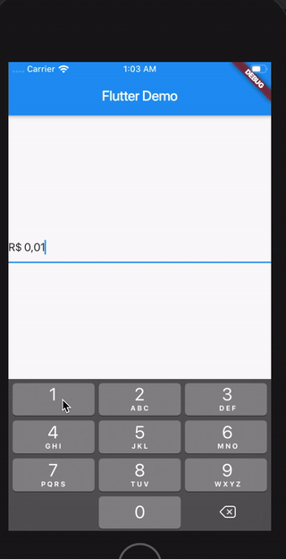

# currency_textfield_2
[](https://cirrus-ci.com/github/Macacoazul01/currency_textfield_2/master)
[](https://pub.dev/packages/currency_textfield_2)

A Controller for currency text input



## Install

Follow this [guide](https://pub.dev/packages/currency_textfield_2/install) 

## Usage

Import the library

```dart
import 'package:currency_textfield_2/currency_textfield_2.dart';
```

Create the Controller
```dart
CurrencyTextFieldController controller = CurrencyTextFieldController()
```

## Parameters and getters


### Currency Symbol, Decimal and Thousand separator

It's possible to customize `leftSymbol`, `decimalSymbol` and `thousandSymbol`:

```dart
var controller = CurrencyTextFieldController(leftSymbol: "RR", decimalSymbol: ".", thousandSymbol: ",");
```

### Get double value and get int value

To get the number value from controller, you can use both the `doubleValue` or the `intValue` properties:

```dart
//Double value:
final double val = controller.doubleValue;
```

```dart
//Int value:
final int val = controller.intValue;
```

### Initial value

You can initialize the controller using a int or a double, but not both at the same time.
To make this, just use `initDoubleValue` or `initIntValue`:

```dart
final CurrencyTextFieldController controller2 = CurrencyTextFieldController(initDoubleValue: 10);
final CurrencyTextFieldController controller3 = CurrencyTextFieldController(initIntValue: 1000);

// this will raise an error!
final CurrencyTextFieldController controller4 = CurrencyTextFieldController(initIntValue: 1000,initDoubleValue: 10);
```

Forked from https://pub.dev/packages/currency_textfield
Updated with fixes and new settings